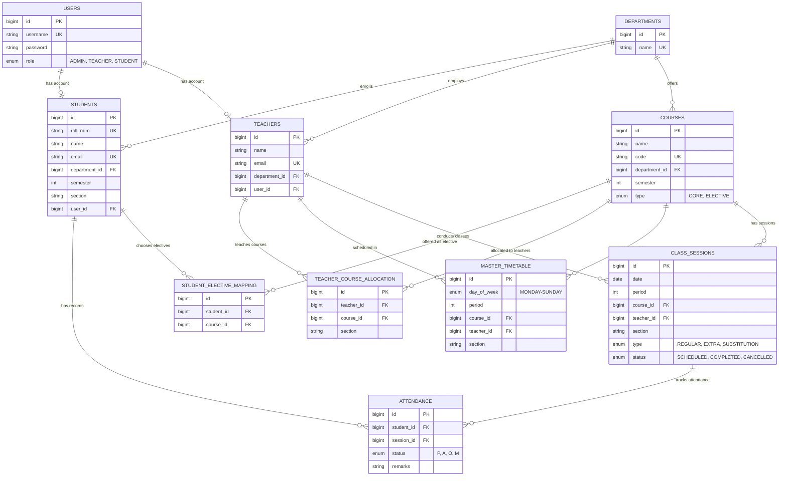

# Attendance Application - Database ER Diagram

This document shows the Entity-Relationship (ER) diagram for the Attendance Application database.

## ER Diagram

## Entity Descriptions

### Core Entities

1. **USERS**
   - Stores authentication credentials for all users
   - Role determines access level (Admin, Teacher, Student)

2. **DEPARTMENTS**
   - Academic departments (e.g., CSE, ECE)
   - Central entity linking students, teachers, and courses

3. **STUDENTS**
   - Student information and enrollment details
   - Links to User for authentication
   - Section determines class grouping

4. **TEACHERS**
   - Faculty information
   - Links to User for authentication

5. **COURSES**
   - Course catalog
   - Type distinguishes between CORE (mandatory) and ELECTIVE courses

### Relationship Entities

6. **STUDENT_ELECTIVE_MAPPING**
   - Many-to-Many: Students ↔ Elective Courses
   - Only used for elective courses (CORE courses are assigned by section)

7. **TEACHER_COURSE_ALLOCATION**
   - Many-to-Many: Teachers ↔ Courses
   - Tracks which teacher teaches which course to which section

### Schedule Entities

8. **MASTER_TIMETABLE**
   - Recurring weekly schedule
   - Defines the regular timetable (Day + Period + Course + Teacher + Section)

9. **CLASS_SESSIONS**
   - Actual class instances for specific dates
   - Generated from Master Timetable but can be modified
   - Supports EXTRA classes and SUBSTITUTIONS

### Tracking Entity

10. **ATTENDANCE**
    - Links students to class sessions
    - Status: P (Present), A (Absent), O (On Duty), M (Medical)

## Key Relationships

- **1:1** → User ↔ Student/Teacher (One user account per student/teacher)
- **1:N** → Department ↔ Students/Teachers/Courses
- **M:N** → Students ↔ Courses (via STUDENT_ELECTIVE_MAPPING for electives)
- **M:N** → Teachers ↔ Courses (via TEACHER_COURSE_ALLOCATION)
- **1:N** → Course ↔ Class Sessions (One course has many sessions)
- **1:N** → Class Session ↔ Attendance (One session has many attendance records)
